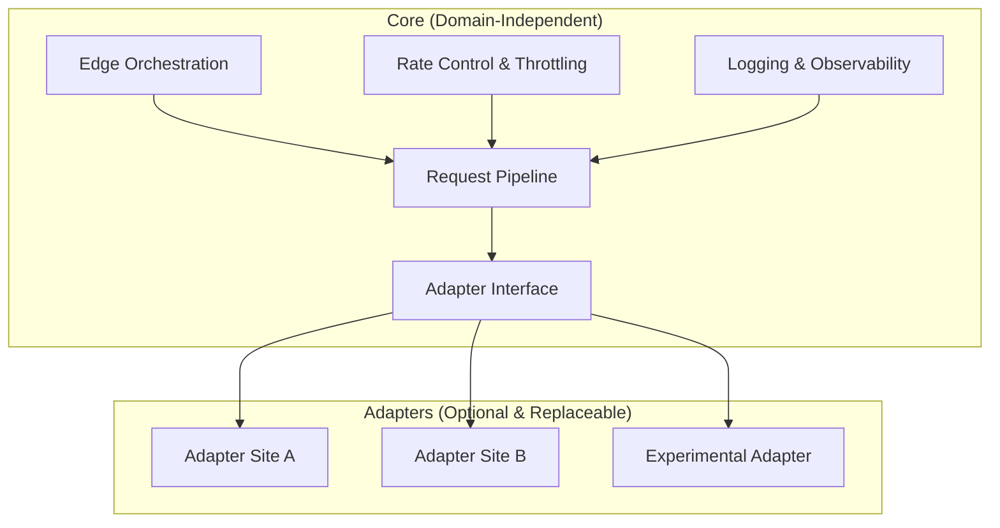
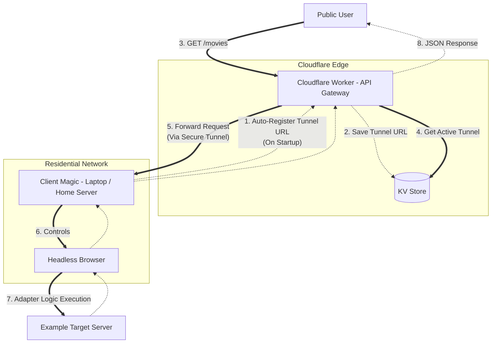

# Edge Adapter Framework

_(Research & Education Project)_

An **Edge Computing-based** framework with a **Core → Adapters** architecture for studying **modern web system behaviors**, edge orchestration, and platform interoperability & protection patterns (rate limits, anti-bot, etc.) in the context of **educational and technical research**.

This project focuses on **system architecture and software engineering**, not on any specific website or content.

> 📘 **Documentation available in multiple languages**:
>
> - 🇮🇩 [Bahasa Indonesia](../../README.md)
> - 🇺🇸 [English](./README.md)
> - 🇨🇳 [简体中文](../zh/README.md)

---

## 🧠 Overview

Modern web platforms employ various protection mechanisms such as:

- Bot detection & fingerprinting
- Rate limiting & IP reputation
- JavaScript-based dynamic challenges

This framework is designed to **study and simulate** these patterns through:

- Edge-based execution
- Modular adapters
- Isolation between _core logic_ and _site-specific behavior_

This approach allows technical exploration without binding the core system to any particular target.

---

## 🧩 System Architecture

The diagram below illustrates a clear separation between **Core** and **Adapters**.

### Core

- Domain-agnostic
- Contains no site-specific scraping logic
- Fully functional even if all adapters are removed

### Adapters

- Optional modules
- Implement the Adapter Interface
- Can be replaced, modified, or removed without affecting the Core
- Serve as technical case examples

---

## 🔬 Adapter Flow Example (Technical Case Study)

This diagram shows the execution flow of one adapter within the framework.

**Brief Flow Explanation:**

1.  The Client Adapter automatically registers its tunnel to the Edge on startup.
2.  Cloudflare Worker stores the active endpoint in KV.
3.  Public users access the API through the Edge.
4.  Worker dynamically selects the active tunnel.
5.  Requests are forwarded through a secure tunnel.
6.  Client controls the headless browser.
7.  Adapter executes target-specific logic.
8.  Data is returned as JSON.

> This flow is optional and can be removed without affecting the Core.

---

## 🎯 Purpose & Scope

**This project is intended for:**

- Learning edge computing
- Studying modular architecture (clean architecture)
- Experimenting with distributed request handling
- Researching anti-bot & platform protection behaviors
- Technical demonstration of reverse engineering in a limited scope

**This project is NOT intended for:**

- Redistributing copyrighted content
- Commercial scraping services
- Bypassing paywalls for financial gain
- Providing access to illegal media

---

## ⚠️ Legal & Ethical Disclaimer

> **This project is created solely for educational, research, and technical experimentation purposes.**

1.  **Core System** is neutral and not tied to any website or content.
2.  **Adapter Implementations**:
    - Optional
    - For technical demonstration
    - Not intended for real-world misuse

**Users are fully responsible for:**

- How it is used
- Targets accessed
- Compliance with local laws and regulations

> Accessing, copying, or distributing copyrighted content without permission may violate laws in certain jurisdictions.

**Project authors:**

- Do not host any content
- Do not provide copyrighted media
- Do not encourage illegal usage
- Are not responsible for third-party misuse

**Make sure you:**

- Have legal rights to the targets tested
- Comply with laws, regulations, and platform policies
- Respect intellectual property rights

---

## 🧪 Research Notes

Mentions of real-world sites, platforms, or services:

- Are used as technical case studies
- Do not indicate affiliation or endorsement
- Aim to analyze system patterns, not content

> Adapters can be fully removed without affecting the Core Framework.

---

## 📜 License

This project is released as **open-source** for learning and research.

- Use responsibly.
- Understand the technical and legal implications of each deployment.

---

## 🧠 Final Notes

> Good software engineering is not just about _what_ can be built, but also _why_ it is built, _how_ it is used, and its impact.
