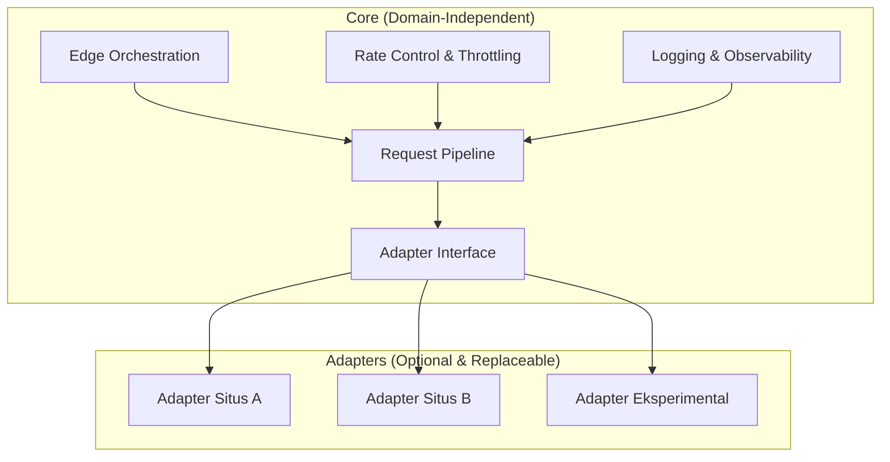
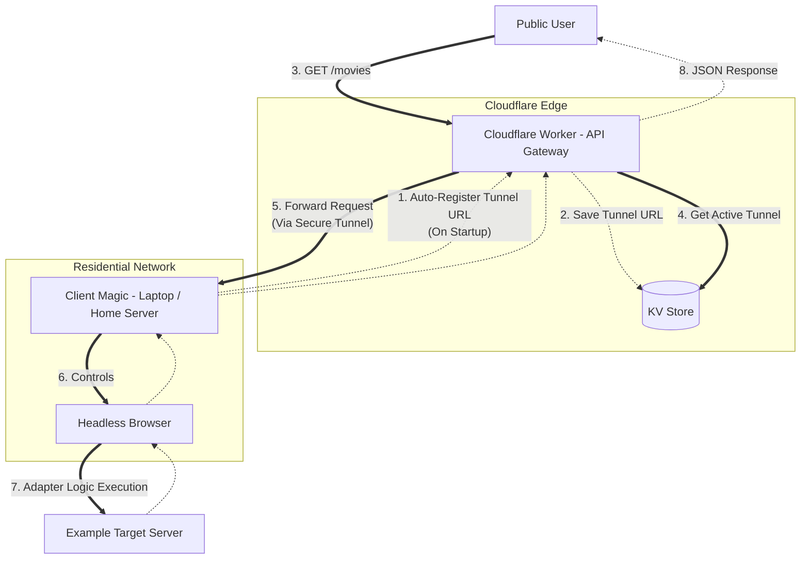

# Edge Adapter Framework

📘 Dokumentasi tersedia dalam beberapa bahasa:

- 🇮🇩 [Bahasa Indonesia](./docs/id/README.md)
- 🇺🇸 [English](./docs/en/README.md)
- 🇨🇳 [简体中文](./docs/zh/README.md)

_(Proyek Riset & Edukasi)_

Framework **berbasis Edge Computing** dengan arsitektur **Core → Adapters** untuk mempelajari **perilaku sistem web modern**, orkestrasi edge, serta pola interoperabilitas dan proteksi platform (rate limit, antibot, dsb) dalam konteks **edukasi dan riset teknis**.

Proyek ini berfokus pada **arsitektur sistem dan rekayasa perangkat lunak**, bukan pada situs atau konten tertentu.

---

## 🧠 Gambaran Umum

Platform web modern menggunakan berbagai mekanisme proteksi seperti:

- Bot detection & fingerprinting
- Rate limiting & IP reputation
- Dynamic challenge berbasis JavaScript

Framework ini dibuat untuk **mempelajari dan mensimulasikan** pola-pola tersebut melalui pendekatan:

- Edge-based execution
- Modular adapter
- Isolasi antara _core logic_ dan _site-specific behavior_

Pendekatan ini memungkinkan eksplorasi teknis tanpa mengikat sistem inti ke satu target tertentu.

---

## 🧩 Arsitektur Sistem

Diagram berikut menunjukkan pemisahan yang jelas antara **Core** dan **Adapters**.

### Core

- Tidak bergantung pada domain atau situs tertentu
- Tidak mengandung logika scraping spesifik
- Tetap berfungsi meskipun seluruh adapter dihapus

### Adapters

- Modul opsional
- Mengimplementasikan Adapter Interface
- Dapat diganti, dimodifikasi, atau dihapus tanpa memengaruhi Core
- Digunakan sebagai contoh kasus teknis

---

## 🔬 Contoh Alur Adapter (Studi Kasus Teknis)

Diagram ini menunjukkan alur eksekusi salah satu adapter dalam framework.

**Penjelasan Singkat Alur:**

1.  Client Adapter mendaftarkan tunnel otomatis ke Edge saat startup.
2.  Cloudflare Worker menyimpan endpoint aktif di KV.
3.  User publik mengakses API melalui Edge.
4.  Worker memilih tunnel aktif secara dinamis.
5.  Request diteruskan melalui tunnel aman.
6.  Client mengontrol browser headless.
7.  Adapter menjalankan logika spesifik target.
8.  Data dikembalikan sebagai JSON.

> Alur ini tidak wajib digunakan dan dapat dihapus tanpa memengaruhi Core.

---

## 🎯 Tujuan & Ruang Lingkup

**Proyek ini ditujukan untuk:**

- Pembelajaran edge computing
- Studi arsitektur modular (clean architecture)
- Eksperimen distributed request handling
- Riset perilaku anti-bot & proteksi platform
- Demonstrasi teknis reverse engineering secara terbatas

**Proyek ini BUKAN untuk:**

- Redistribusi konten berhak cipta
- Layanan scraping komersial
- Melewati paywall untuk keuntungan finansial
- Penyediaan akses ke media ilegal

---

## ⚠️ Disclaimer Hukum & Etika

> **Proyek ini dibuat semata-mata untuk tujuan edukasi, riset, dan eksperimen teknis.**

1.  **Sistem Core** bersifat netral, tidak terikat pada situs atau konten tertentu.
2.  **Implementasi Adapter**:
    - Opsional
    - Sebagai contoh teknis
    - Tidak dimaksudkan untuk penyalahgunaan di dunia nyata

**Pengguna bertanggung jawab penuh atas:**

- Cara penggunaan
- Target yang diakses
- Kepatuhan terhadap hukum dan regulasi lokal

> Mengakses, mengambil, atau mendistribusikan konten berhak cipta tanpa izin dapat melanggar hukum di wilayah tertentu.

**Penulis proyek:**

- Tidak meng-host konten apa pun
- Tidak menyediakan media berhak cipta
- Tidak mendorong penggunaan ilegal
- Tidak bertanggung jawab atas penyalahgunaan oleh pihak ketiga

**Pastikan Anda:**

- Memiliki hak legal atas target yang diuji
- Mematuhi hukum, regulasi, dan kebijakan platform
- Menghormati hak kekayaan intelektual

---

## 🧪 Catatan Riset

Penyebutan situs, platform, atau layanan dunia nyata:

- Digunakan sebagai studi kasus teknis
- Tidak menunjukkan afiliasi atau dukungan
- Bertujuan menganalisis pola sistem, bukan kontennya

> Adapter dapat dihapus sepenuhnya tanpa memengaruhi Core Framework.

---

## 📜 Lisensi

Proyek ini dirilis sebagai **open-source** untuk pembelajaran dan riset.

- Gunakan secara bertanggung jawab.
- Pahami konsekuensi teknis dan hukum dari setiap deployment.

---

## 🧠 Catatan Akhir

> Rekayasa perangkat lunak yang baik bukan hanya soal _apa_ yang bisa dibuat, tetapi juga _mengapa_ dibuat, _bagaimana_ digunakan, dan dampaknya.
