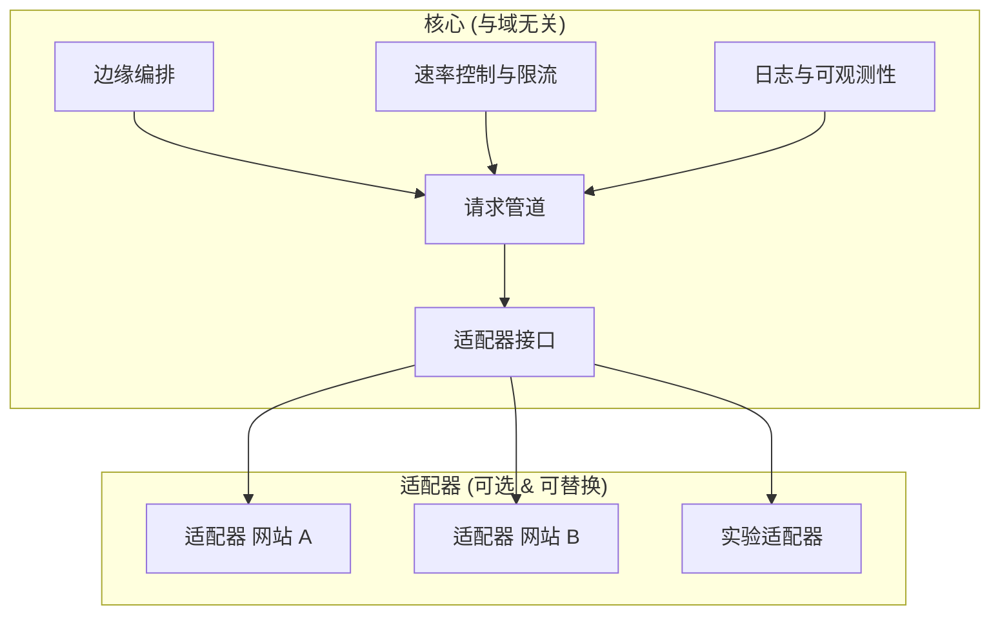
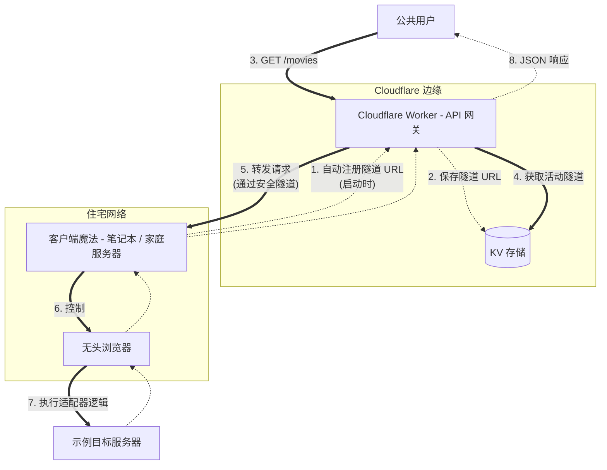

# Edge Adapter Framework

_(研究与教育项目)_

一个 **基于边缘计算 (Edge Computing)** 的框架，采用 **Core → Adapters** 架构，用于研究 **现代网络系统行为**、边缘编排以及平台互操作性与保护模式（速率限制、反机器人等），在 **教育与技术研究** 的背景下使用。

本项目关注 **系统架构与软件工程**，而非任何特定网站或内容。

> 📘 **文档提供多语言版本**：
>
> - 🇮🇩 [Bahasa Indonesia](../../README.md)
> - 🇺🇸 [English](../en/README.md)
> - 🇨🇳 [简体中文](./README.md)

---

## 🧠 概述

现代网络平台使用各种保护机制，例如：

- 机器人检测 & 指纹识别
- 速率限制 & IP 声誉
- 基于 JavaScript 的动态挑战

本框架旨在通过以下方法 **学习并模拟** 这些模式：

- 基于边缘的执行
- 模块化适配器
- 核心逻辑与特定网站行为的隔离

这种方法允许进行技术探索，而无需将核心系统绑定到特定目标。

---

## 🧩 系统架构

下图展示了 **Core** 与 **Adapters** 的清晰分离。

### 核心 (Core)

- 与域无关
- 不包含特定网站的爬取逻辑
- 即使删除所有适配器，也能正常运行

### 适配器 (Adapters)

- 可选模块
- 实现适配器接口
- 可替换、修改或删除而不影响核心
- 用作技术案例示例

---

## 🔬 适配器流程示例（技术案例研究）

此图展示框架中一个适配器的执行流程。

**流程简述：**

1.  客户端适配器在启动时自动向边缘注册隧道。
2.  Cloudflare Worker 将活动端点存储在 KV 中。
3.  公共用户通过边缘访问 API。
4.  Worker 动态选择活动隧道。
5.  请求通过安全隧道转发。
6.  客户端控制无头浏览器。
7.  适配器执行目标特定逻辑。
8.  数据以 JSON 返回。

> 此流程为可选，可删除而不影响核心。

---

## 🎯 目标与范围

**本项目适用于：**

- 学习边缘计算
- 研究模块化架构（干净架构）
- 分布式请求处理实验
- 研究反机器人与平台保护行为
- 有限范围的技术逆向演示

**本项目不适用于：**

- 重新分发受版权保护的内容
- 商业爬取服务
- 为盈利绕过付费墙
- 提供非法媒体访问

---

## ⚠️ 法律与伦理免责声明

> **本项目仅用于教育、研究及技术实验目的。**

1.  **核心系统 (Core System)** 中立，不绑定任何网站或内容。
2.  **适配器实现**：
    - 可选
    - 技术示例
    - 不用于真实环境滥用

**用户需完全负责：**

- 使用方式
- 访问目标
- 遵守当地法律法规

> 未经许可访问、复制或分发版权内容可能违反特定司法管辖区的法律。

**项目作者：**

- 不托管任何内容
- 不提供版权媒体
- 不鼓励非法使用
- 对第三方滥用不承担责任

**确保您：**

- 对测试目标拥有合法权利
- 遵守法律、法规及平台政策
- 尊重知识产权

---

## 🧪 研究说明

提及的真实网站、平台或服务：

- 用作技术案例研究
- 不表示任何隶属或支持
- 旨在分析系统模式，而非内容

> 适配器可完全删除而不影响核心框架。

---

## 📜 许可

本项目以 **开源** 形式发布，用于学习与研究。

- 请负责任地使用
- 理解每次部署的技术与法律影响

---

## 🧠 结语

> 优秀的软件工程不仅关乎 _能构建什么_，还关乎 _为什么构建_、_如何使用_ 以及其影响。
